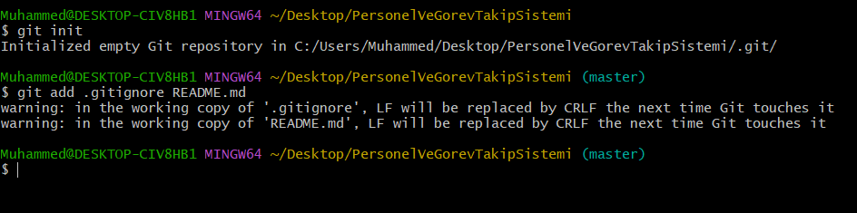
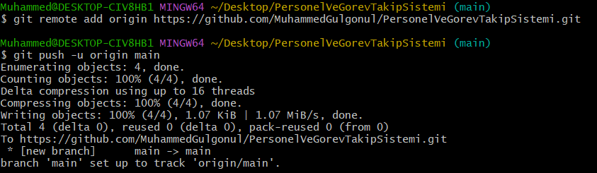

# 1. Hafta Raporu: Ortam Hazırlığı ve Proje Yapısının Kurulması

**Tarih:** 30 Haziran 2026  
**Proje Adı:** Personel ve Görev Takip Sistemi  

---

## Bu Hafta Yapılan Çalışmalar

### 1. Geliştirme Ortamının Kurulması
Projenin geliştirilmesinde kullanılacak temel yazılım ve araçların kurulumları tamamlanmıştır:
* **Visual Studio 2026:** C# kodlarını yazmak, projeyi derlemek ve çalıştırmak için entegre geliştirme ortamı kurulmuştur.
* **.NET 8.0 SDK:** Projenin derleme ve çalışma altyapısı için gerekli olan yazılım geliştirme kiti sisteme yüklenmiştir.
* **Microsoft SQL Server:** Projenin veritabanı altyapısı için SQL Server veritabanı motoru kurulmuştur.
* **SQL Server Management Studio (SSMS):** Veritabanı tablolarını ve verileri görsel olarak yönetmek için SSMS programı kurulmuştur.

  

---

### 2. Visual Studio Üzerinde Katmanlı Mimarinin Yapılandırılması
Projenin kurumsal standartlara uygun olarak yönetilebilir olması amacıyla Visual Studio 2022 üzerinde katmanlı mimari iskeleti kurulmuştur:
* Visual Studio üzerinde boş bir çözüm oluşturulmuştur.
* Çözüme sırasıyla **Core**, **DataAccess**, **Business** ve **WebUI** projeleri uygun şablonlar seçilerek eklenmiştir.
* Projelerin aralarında veri alışverişi yapabilmesi için Visual Studio üzerinden gerekli proje referansları tanımlanmıştır.

---

### 3. Git Versiyon Kontrol Entegrasyonu
Proje kodlarının sürüm takibi ve güvenli bir şekilde yedeklenmesi için Git entegrasyonu tamamlanmıştır:
* Proje dizininde Git başlatılmış ve uzak depo bağlantısı kurulmuştur.
* Gereksiz derleme ve sistem dosyalarının depoya yüklenmesini önlemek için `.gitignore` dosyası eklenmiştir.
* Projenin genel amacını açıklayan `README.md` dosyası oluşturulmuştur.
* Projenin bu başlangıç yapısı ilk commit oluşturularak GitHub uzak deposuna yüklenmiştir.

---

## Gelecek Haftanın Planı
* Veritabanı tablolarına karşılık gelen sınıfların yazılması.
* Entity Framework Core bağlantısının yapılandırılması ve tabloların SQL Server veritabanında oluşturulması.
